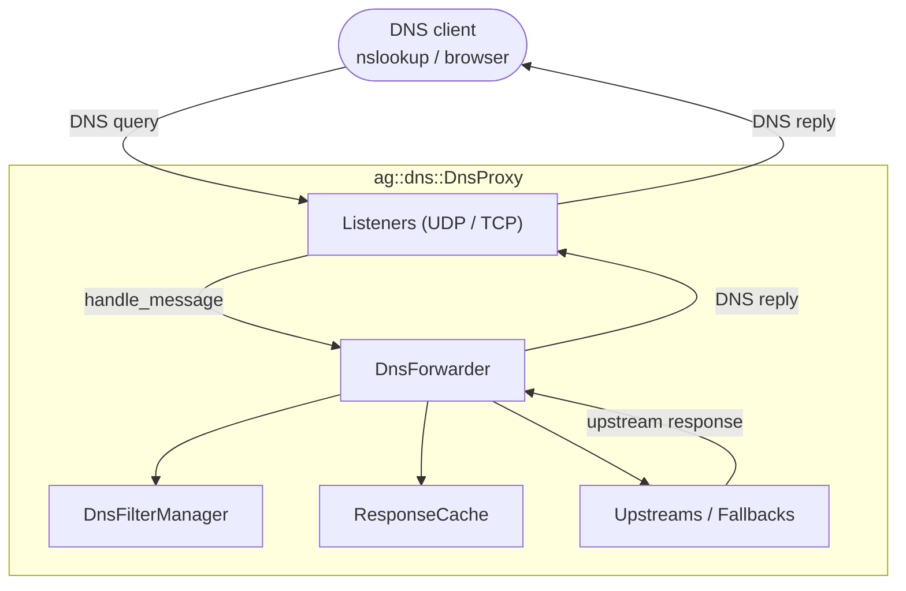
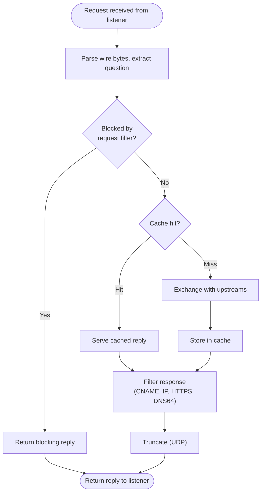
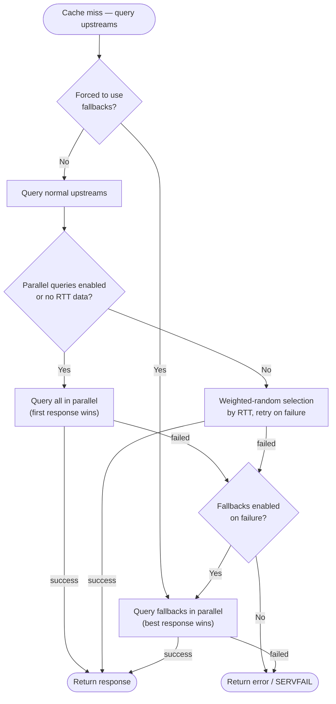

# Architecture overview

The diagram below shows the main components of the DNS proxy at a high level. Two more detailed
diagrams — the request-processing pipeline and the upstream-selection flow — appear in the
[`DnsForwarder`](#agdnsdnsforwarder) section.



`DnsProxy` owns the listeners, the forwarder, the filter manager, and the response cache. Both the
UDP and the TCP listener call the same `DnsForwarder::handle_message()` method, so the request is
processed by a single unified pipeline (`handle_message_internal()`). Caching, filtering, and
upstream exchange are therefore shared and happen once per request. The response is returned to
whichever listener received the request, then sent back over the matching transport.

## Main classes and structures

The core implementation lives in the `proxy/` directory.

### `ag::dns::DnsProxy`

Main class. It receives settings from the user, initializes `DnsForwarder` and `DnsProxyListener`s, and exposes the
public API for processing DNS messages. Important methods include:

- `init()` — initialize the proxy with settings and events.
- `handle_message()` — coroutine-based request handler.
- `handle_message_sync()` — synchronous wrapper around `handle_message()`.
- `reapply_settings()` — update configuration without full reinitialization.
- `match_fallback_domains()` — check whether a request's domain should use fallback upstreams.

The class uses a PIMPL idiom and emits events via `DnsProxyEvents` (e.g., `on_request_processed`).

### `ag::dns::DnsProxySettings`

Settings structure. Default values come from the static `DnsProxySettings::get_default()` method, defined in
`proxy/dnsproxy.cpp` and backed by a single `DEFAULT_PROXY_SETTINGS` constant. Start from `get_default()` and override
only the fields you need. The defaults are intentionally minimal: no upstreams, fallbacks, listeners, or filters are
configured, but a curated `fallback_domains` list (local/lan domains, Wi-Fi calling ePDG hosts, router admin hosts) and
several safe-by-default behaviors are provided:

| Field | Default |
| --- | --- |
| `upstreams` / `fallbacks` / `listeners` / `filter_params` | empty |
| `fallback_domains` | curated list of local, ePDG, and router-admin domains |
| `dns64` | `std::nullopt` (disabled) |
| `outbound_proxy` | `std::nullopt` (no outbound proxy) |
| `block_ipv6` | `false` |
| `ipv6_available` | `true` |
| `dns_cache_size` | `1000` |
| `optimistic_cache` | `true` |
| `enable_dnssec_ok` | `false` |
| `enable_retransmission_handling` | `false` |
| `enable_parallel_upstream_queries` | `false` |
| `enable_fallback_on_upstreams_failure` | `true` |
| `enable_http3` | `false` |
| `enable_post_quantum_cryptography` | `true` |
| `blocked_response_ttl_secs` | `3600` |
| `adblock_rules_blocking_mode` | `REFUSED` (`UNSPECIFIED_ADDRESS` on Windows) |
| `hosts_rules_blocking_mode` | `ADDRESS` |
| `upstream_timeout` | `0` (uses the upstream default of 5 seconds) |

The most interesting fields are:

- `std::vector<UpstreamOptions> upstreams` and `fallbacks` — lists of preferred and reserve DNS servers.
  `UpstreamOptions` contains:
    - `std::string address` — DNSLibs supports UDP DNS, TCP DNS, DoH, DoT, DNSCrypt, and DoQ protocols.
      Examples:
        - `8.8.8.8:53` plain DNS.
        - `tcp://8.8.8.8:53` plain DNS over TCP.
        - `tls://1.1.1.1` DNS-over-TLS.
        - `https://dns.adguard.com/dns-query` DNS-over-HTTPS.
        - `quic://dns.adguard.com:853` DNS-over-QUIC.
        - `sdns://...` DNS stamp (see [DNSCrypt specifications](https://dnscrypt.info/stamps-specifications)).
    - `std::vector<std::string> bootstrap` — list of plain DNS servers used to resolve the hostnames in the upstream addresses.
    - `int32_t id` — user-provided upstream identifier.
    - `std::vector<std::string> fingerprints` — optional SPKI fingerprints for TLS certificate pinning.
    - `bool ignore_proxy_settings` — if true, the outbound proxy is not used for this upstream.
    - `bool enable_post_quantum_cryptography` — enable ML-KEM-768 for TLS connections.
- `std::vector<std::string> fallback_domains` — domains that are always forwarded to fallback upstreams.
- `std::optional<Dns64Settings> dns64` — DNS64 prefix discovery settings.
- `DnsFilter::EngineParams filter_params` — filtering engine parameters, including a list of filters. Each filter can be
  a file path or an in-memory rules string (`FilterParams::in_memory`).
- `std::vector<ListenerSettings> listeners` — list of addresses/ports/protocols to listen on. Settings include:
    - `std::string address` — the address to listen on.
    - `uint16_t port` — the port to listen on.
    - `utils::TransportProtocol protocol` — `TP_UDP` or `TP_TCP`.
    - `bool persistent` — if true, do not close the TCP connection after sending the first response.
    - `Millis idle_timeout` — close the TCP connection this long after the last request is received.
    - `evutil_socket_t fd` — if not `-1`, listen on this pre-bound file descriptor.

Other notable fields include:

- `std::optional<OutboundProxySettings> outbound_proxy` — outbound (upstream) proxy configuration. When set, all
  upstream exchanges are routed through the proxy unless an upstream opts out via `ignore_proxy_settings`. Contains the
  proxy `protocol` (`HTTP_CONNECT`, `HTTPS_CONNECT`, `SOCKS4`, `SOCKS5`, or `SOCKS5_UDP`), `address`, `port`, `bootstrap`
  resolvers, optional `auth_info`, and `trust_any_certificate`.
- `bool block_ipv6` — drop all `AAAA` queries by responding with an empty SOA record, before any upstream exchange.
- `bool ipv6_available` — when `false`, the bootstrappers (used to resolve upstream hostnames) fetch only `A` records,
  so no IPv6 connectivity is assumed. Does not affect the actual forwarded requests.
- `size_t dns_cache_size` — maximum number of entries the `ResponseCache` (`LruCache`) holds; the capacity is applied via
  `ResponseCache::set_capacity()`.
- `bool optimistic_cache` — serve expired cache entries with a TTL of 1 second while the upstreams are re-queried in the
  background to refresh the entry.
- `bool enable_dnssec_ok` — set the DNSSEC OK (DO) bit on outgoing queries so that servers include DNSSEC records. May
  increase traffic and the chance of TCP fallbacks.
- `bool enable_retransmission_handling` — detect retransmitted UDP requests (same query repeated by the client) and, on
  a retransmission, query fallback upstreams only. No effect on TCP.
- `bool enable_parallel_upstream_queries` — if `true`, all upstreams are queried in parallel and the first response wins;
  otherwise a single upstream is selected by weighted random based on RTT. Fallback upstreams are always queried in
  parallel regardless of this setting.
- `bool enable_http3` — let DNS-over-HTTPS upstreams use HTTP/3 when it can connect faster than HTTP/2.
- `bool enable_post_quantum_cryptography` — enable post-quantum key exchange (`ML-KEM-768`) for TLS upstreams.

### `ag::dns::DnsProxyListener`

The input class for user queries. It works with UDP or TCP plain DNS requests. The public API is the factory method
`DnsProxyListener::create_and_listen()`. The listener runs on the shared `EventLoop`, receives a request, and invokes
`DnsProxy::handle_message()` (a coroutine) to process it. When the coroutine completes, the response is sent back to
the user and the allocated memory is released.

### `ag::dns::DnsForwarder`

A class that processes user DNS requests. During initialization, it creates vectors of real upstreams from the
`UpstreamOptions` and loads the filtering engine.

`DnsForwarder::handle_message_internal()` processes a request through the pipeline below:



At a high level the steps are, in order:

1. Parse the request.
2. Apply filters to the request (request-level blocking/rewriting).
3. Handle IPv6 blocking, DDR (RFC 9462) blocking, and ECH/H3 ALPN blocking as configured.
4. Check the response cache (and the optimistic cache, if enabled).
5. Exchange with upstreams. When `enable_parallel_upstream_queries` is true, all upstreams are queried in parallel;
   otherwise, weighted random selection based on RTT is used. Fallback upstreams are always queried in parallel.
6. Apply filters to the response (CNAME, IP, HTTPS/SVCB matching, etc.).
7. Perform DNS64 synthesis, if enabled.
8. Truncate the response for UDP if needed.

When the cache is missed, the forwarder selects upstreams as shown below (step 5):



The method returns a raw DNS response buffer. It emits `DnsProxyEvents::on_request_processed` with details about the
request.

## Filtering

Filter lists can be loaded from files or from in-memory strings (`FilterParams::in_memory`). The engine processes each
rule and logs parsing diagnostics.

You can add your own filters in `listener_standalone`:

```c++
settings.filter_params.filters.push_back({ 0, "/Users/user/my_rules.txt", false });
```

Or load rules from memory:

```c++
settings.filter_params.filters.push_back({ 0, "||example.com\n", true });
```

Rule examples:

- hosts-like rule:
    - `127.0.0.1 example.com` blocks `example.com` (exact match; subdomains like `ad.example.com` are not blocked).
- basic rule:
    - `@@` — exception rules marker. Rules starting with `@@` disable filtering of matching addresses.
    - `||example.com` blocks `http://example.com/ad1.gif` and `https://example.com/ad1.gif` queries. `||` means matching
      the beginning of a hostname.
    - `example.*` blocks `example.com` and `example.org` queries. `*` is a wildcard character.
- modifiers:
    - `$important` increases the priority of a rule over any other rule without the `$important` modifier.
      For example: `example.org$important`.
    - `$badfilter` disables other rules to which they refer. For example: `||example.com$badfilter` disables
      `||example.com`.
    - `$dnstype` — match by DNS record type. For example: `||example.org^$dnstype=AAAA`.
    - `$dnsrewrite` — modify the DNS response (CNAME, A, AAAA, MX, SVCB/HTTPS, response code, etc.).
      For example: `||example.com^$dnsrewrite=1.2.3.4`.
    - `$denyallow` — exclude specific domains from a blocking rule. For example: `*$denyallow=com|net`.

## Useful notes

- RFCs of DNS [1034](https://tools.ietf.org/html/rfc1034), [1035](https://tools.ietf.org/html/rfc1035);
- RFC of DNS-over-TLS [7858](https://tools.ietf.org/html/rfc7858);
- RFC of DNS-over-HTTPS [8484](https://tools.ietf.org/html/rfc8484);
- RFC of DNS-over-QUIC [9250](https://tools.ietf.org/html/rfc9250);
- [DNSCrypt](https://dnscrypt.info/stamps-specifications/) specifications;
- An Introduction to [libuv](https://nikhilm.github.io/uvbook/An%20Introduction%20to%20libuv.pdf);
- [LDNS](https://www.nlnetlabs.nl/documentation/ldns/) docs;
- [Filtering rules syntax](https://adguard-dns.io/kb/general/dns-filtering-syntax/);
- [AdGuard Forum](https://forum.adguard.com) for questions and discussions.
