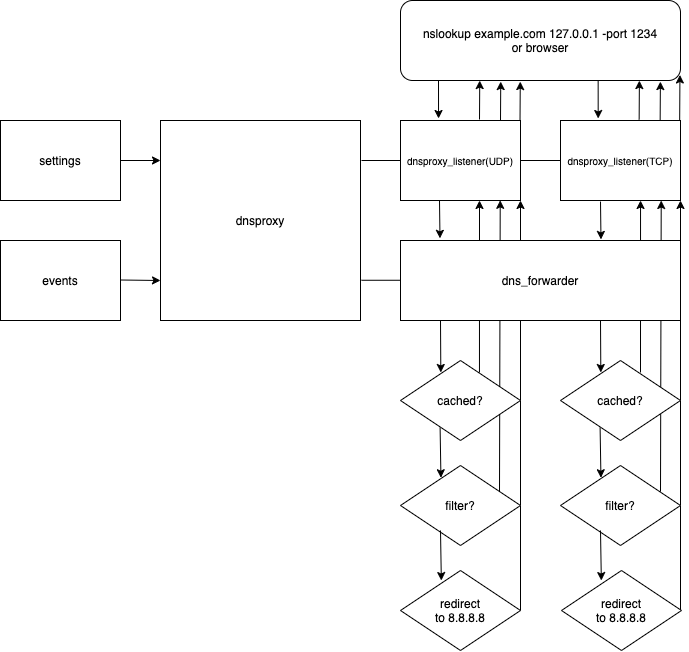

# AdGuard DNSLibs developer documentation

## Contents

* [Introduction](#introduction)
* [How to start?](#howtostart)
* [Coding style](#codingstyle)
* [Project structure](#projstructure)
* [Main classes and structures](#main)
* [Own ad filter](#adfilter)
* [Useful notes](#notes)

<a name="introduction"></a>
## Introduction

AdGuard DNSLibs is an open-source proxy server that caches, filters, encrypts and redirects DNS requests.
Supports all existing protocols including DNS-over-HTTPS, DNS-over-TLS and DNSCrypt.
In this documentation, you will find base information for the developing and support code of AdGuard DNSLibs project
and filters. Also, you can ask your question [here](https://forum.adguard.com).

<a name="howtostart"></a>
## How to start?

After cloning source files init submodules
```
git submodule init
git submodule update
```
Next, create a directory and build project
```
mkdir build && cd build
cmake ..
make -j4 listener_standalone
```
By default, listener_standalone runs like proxy-server on UDP-port 1234 and TCP-port 1234 and just redirect all dns-requests
to 8.8.8.8:53 or 8.8.4.4:53. As you see in file `proxy/test/listener_standalone.cpp` you can change settings (e.g. port or timeout).
More details about the settings [below](#proxysettings).

#### Block diagram


<a name="codingstyle"></a>
## Coding style

### Language
- DNSLibs uses C++17 standard

### Naming
- under_score naming for classes, members, functions and variables
- UNDER_SCORE naming for constants, enum constants
- Namespaces:
    - Use `ag` namespace for our classes.
    - Use `namespace ... {}` for declarations (usually in headers).
    - Don't use `namespace ... {}` (inc. anonymous namespaces) for definitions (usually in the source file).
- Prefixes: 
    - Hungarian notation is prohibited in non-third-party code.
    - Only allowed prefixes are `_` and `m_`. 
- Suffixes: 
    - No suffixes, even `_t`

### Language features
- Using:
    - Always use `using` instead of `typedef`.
    - Both `using` and `using namespace` is allowed, except:
    - `using namespace std;` is forbidden.
    - `using namespace` in global the scope is forbidden in headers.
- Enums:
    - Both `enum` and `enum class` are allowed, depending on the desired visibility of constants.
- Trailing return type:
    - Use only with templates and only if necessary.
- Switch cases:
    - Use `[[fallthrough]]` if switch case contains one or more statements and should fall through to the next switch case.
- Comments:
    - Should start from capital letter.
    - See "Doxygen comments" for info about Doxygen comments.
- Exceptions:
    - C++ exceptions should not be used.

### Indentation and style
- K&R style, but:
    - Basic indent - 4 spaces. Tabs are not allowed.
    - UTF-8 encoding, `\n` line endings.
    - Function body start: the same line.
    - Constructor body start: next line after member initializers.
    - Binary operators like `+`, `-`, etc. should have spaces around them.
    - `if()`, `for()`, `while()`:
        - Use a compound statement even if it contains a single statement.
        - If the loop has no body, use a compound statement with `// does nothing`.
        - Compound statement braces start: the same line.
        - `else`: the same line with compound statement end.
    - Namespace content not indented.
    - Switch cases are not indented.
    - Pointer and reference symbols: space between type and `*` or `&`, 
      no space between the identifier and `*` or `&`.
    - Line wrapping for conditions:
        ```c++
        if ((condition1 && condition2)
                || (condition3 && condition4)
                || !(condition5 && condition6)) {
            do_something_about_it();
        }
        ```

### Header guard
Use non-standard but useful extension `#pragma once`. 
`#ifdef` style guards are not allowed in non-third-party code.

### Doxygen comments
- All public methods and functions should be documented.
- Use Javadoc style with an `autobrief` feature.
- `autobrief` means that the first statement of a long description automatically becomes a brief description. So `@brief` is redundant.
- Use `@return`, not `@returns`
- Use `[out]` in `@param` only if code is not explanatory.
- Don't use `[in]` in `@param`.
- Don't use extra line endings.
- Use infinitive instead of the third person in brief descriptions.
- Descriptions should start with a capital letter.

Examples:
```
/**
 * Sum of x and y.
 * This function is usually used to get sum of x and y.
 * @param x The x
 * @param yy The y
 * @return Sum of x and y.
int plus(int x, int yy) {
    return x + yy;
}
enum class t {
    A, /**< One-line post-identifier comment */
    /** Another one-line comment */
    B,
    /** Third one-line comment */
    C,
    D, /**< One-line post-identifier comment */
}
```

<a name="logging"></a>
### Logging
- Log messages should start with a capital letter.
- Use WARN/ERROR level only for internal logic warnings/errors and network errors that make the library unusable.
- Use INFO level for messages of regular proxy operation that regular users will see in their log.
- Use DEBUG level for messages that will be logged only with debug logging on.
    - This includes non-fatal network errors, malformed responses, etc. Why network-related errors are usually "DEBUG" level?
    These errors are part of the regular operation of a network client, so they reported in reply to the client of the library.
- Use TRACE debug level for trace messages.
    
### Code sample
type.h
```c++
namespace ag {

struct type {
    int x;
    type();
    std::string *func(const std::string &param);
}

} // namespace ag
```
type.cc
```c++
static constexpr auto FIVE = 5;

ag::type() : x(0)
{
}

std::string *ag::func(const std::string &param) {
    if (time(nullptr) % 2 == 0) {
        return new std::string(param);
    } else {
        std::string *ret = nullptr;
        for (int i = x; i < 10; i++) {
            switch (i) {
            case FIVE:
                ret = new std::string(std::to_string(FIVE) + ", not " + param);
                break;
            default:
                std::clog << "not " << FIVE << std::endl;
                break;
            }
        }
        return ret;
    }
}
```

<a name="projstructure"></a>
## Project structure

Every subproject consists of the following directories and files:
- `include/` - public headers
- `src/` - source code files and private headers
- `test/` - tests and its data
- `CMakeLists.txt` - cmake build config. Should be self-configurable.

Root project consists of the following directories and files:
- `common/` - Set of useful general-purpose utilities
- `dnscrypt/` - DNSCrypt client implementation
- `dnsfilter/` - DNS filter implementation
- `dnsstamp/` - DNSCrypt server stamps encoder/decoder
- `platform/` - Platform-specific interfaces and adapters
- `proxy/` - DNS proxy implementation
- `third-party/` - third-party libraries (this is not a subproject, so subproject's rules are not enforced)
- `tls/` - TLS communication-related things (e.g. certificate verifier)
- `upstream/` - Working with DNS upstreams
- `CMakeLists.txt` - main cmake build config. Should build common things and include
  platform-specific things.

<a name="main"></a>
## Main classes and structures
You can find the implementation of each unit from this list in the folder `proxy/`.

### `ag::dnsproxy`
Main class. It receives settings from the user and initializes `dns_forwarder` and `dns_listeners`.
Each class can also contain `ag::logger`. More details about the syntax of the log you can find [above](#logging).

<a name="proxysettings"></a>
#### `ag::dnsproxy_settings`
Settings structure, comes from the user. Most interesting fields:
- `std::vector<upstream_options> upstreams and fallbacks` Lists of preferred and reserve DNS servers. If the user's query not
cached or filtered, then these servers will respond. `upstream_options` contains:
    - `std::string address` DNSLibs supports UDP DNS, TCP DNS, DoH, DoT, DNSCrypt protocols. Here are examples of string `address`:
        - `8.8.8.8:53` plain DNS.
        - `tcp://8.8.8.8:53` plain DNS over TCP.
        - `tls://1.1.1.1` DNS-over-TLS.
        - `https://dns.adguard.com/dns-query` DNS-over-HTTPS.
        - `sdns://...` DNS stamp (see [DNSCrypt](https://dnscrypt.info/stamps-specifications) specifications).
    - `std::vector<std::string> bootstrap` List of plain DNS servers to be used to resolve the hostname in upstreams' address.
- `dnsfilter::engine_params filter_params` Filtering engine parameters. Contains a vector of file paths with filter rules.
- `std::vector<listener_settings> listeners` List of addresses/ports/protocols/etc... to listen on. We will talk about
listeners later, but settings may consider now:
    - `std::string address{"::"}` The address to listen on.
    - `uint16_t port{53}` The port to listen on.
    - `listener_protocol protocol{listener_protocol::UDP}` The protocol to listen for.
    - `bool persistent{false}` If true, don't close the TCP connection after sending the first response.
    - `std::chrono::milliseconds idle_timeout{3000}` Close the TCP connection this long after the last request received.

#### `ag::dnsproxy_listener`
The input class for user queries. At the moment works with UDP or TCP plain requests.
It is extended by the `listener_base` class, which in turn is extended by the `listener_udp` and `listener_tcp` classes.
Initialization has two steps:
- `listener_base::init()` Here a logger is created, settings are set, etc.
Later in this function, a thread will start to listen to the socket.
- `listener_udp(or listener_tcp)::before_run()` Depending on the type of protocol, the structure of `libuv` library is
initialized for working with network sockets.

Then `dnsproxy_listener` prepared for work.
After receiving a user's request `dnsproxy_listener`, thanks to `libuv`, puts a sync call
`dns_forwarder::handle_message()` with a request to the queue. `work_cb()` do this call. When `dns_forwarder` answers,
the response is sent to the user and memory will be cleared.

#### `ag::dns_forwarder`
A class that processes user DNS requests.
During class initialization, depending on the `upstream_options`, vectors with real upstream are created using the Factory
Method programming pattern.
Next, the filtering module is loaded.
About filters and rules see [below](#filterrules).
`dns_forwarder::handle_message()` is the second important method of the `dns_forwarder` class that takes a user DNS request
from `dnsproxy_listener`. Here few variants for return:  
- The first step is to check for the existence of this domain name in the cache. If a cached record is found, the data are
returned to the user application.
- Next, filters are applied. If a filter rule is found, the function will return `dnsproxy_blocking_mode`.
- Next, if no cache or filter rule, there is an exchange with upstreams. Moreover, the upstreams are divided into upstreams and fallbacks.
Both vectors are sorted by RTT. This allows us to query the fastest servers first. Then traffic is encrypted depending on the
type of upstream in `upstream::exchange()` and query follow to upstream. Then response goes back to the user's app throw
`dnsproxy_listener` witch call `dns_forwarder::handle_message()`.

<a name="filterrules"></a>
## Own ad filter

Filter lists are loaded from files. In the future will be added the ability to load from memory.
The file is processed line by line. The result of processing each line is placed in the log. Here is an example, how you
can add own filters in `listener_standalone`:
```
settings.filter_params.filters.push_back( { 0, "/Users/user/my_rules.txt" } );
```
Now let's see a few examples of rules:
- hosts-like rule:
    - `127.0.0.1 example.com` blocks `example.com` and `ad.example.com` queries.
- basic rule:
    - `@@` - exception rules marker. Rules starting with `@@` disable filtering of matching addresses.
    - `||example.com` blocks `http://example.org/ad1.gif` and `https://example.org/ad1.gif` queries.
    Here `||` means matching the beginning of an address. With this character, you don't have to specify a particular
    protocol and subdomain in the address mask.
    - `example.*` blocks `example.com` and `example.org` queries. `*` - wildcard character.
    It is used to represent "any set of characters".
- and two modifiers:
    - `$important` modifier applied to a rule increases its priority over any other rule without $important modifier.
    Even over basic exception rules. E.g. `example.org$important`.
    - `$badfilter` modifier disable other basic rules to which they refer. It means that the text of the disabled rule should match
    the text of the `badfilter` rule (without the `badfilter` modifier). E.g `||example.com$badfilter` disables `||example.com`.

<a name="notes"></a>
## Useful notes

- RFCs of DNS [1034](https://tools.ietf.org/html/rfc1034), [1035](https://tools.ietf.org/html/rfc1035);
- RFC of DNS-over-TLS [7858](https://tools.ietf.org/html/rfc7858);
- RFC of DNS-over-HTTPS [8484](https://tools.ietf.org/html/rfc8484);
- [DNSCrypt](https://dnscrypt.info/stamps-specifications/) specifications;
- An Introduction to [libuv](https://nikhilm.github.io/uvbook/An%20Introduction%20to%20libuv.pdf);
- [LDNS](https://www.nlnetlabs.nl/documentation/ldns/) docs;
